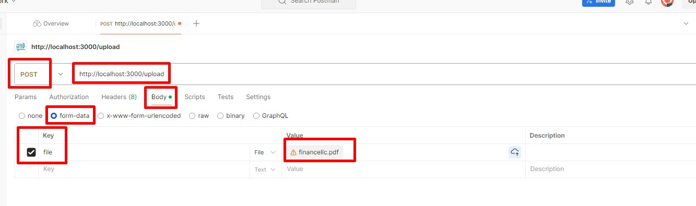

## Application testing
I used POSTMAN to test the application.


Or use CURL:
```
curl --location 'http://localhost:3000/upload' \
--form 'file=@"/C:/Users/user/local/path/to/file/financellc.pdf"'
```

## Result response:
```
{
    "pdfData": {
        "Company Name": "FinanceLLC",
        "Industry": "Financial Services",
        "Market Capitalization": 4500,
        "Revenue (in millions)": 1200,
        "EBITDA (in millions)": 400,
        "Net Income (in millions)": 150,
        "Debt (in millions)": 300,
        "Equity (in millions)": 1000,
        "Enterprise Value (in millions)": 4400,
        "P/E Ratio": 18,
        "Revenue Growth Rate (%)": 15,
        "EBITDA Margin (%)": 33.33,
        "ROE (Return on Equity) (%)": 20,
        "ROA (Return on Assets) (%)": 12,
        "Current Ratio": 3,
        "Debt to Equity Ratio": 0.3,
        "Location": "Boston, MA",
        "CEO": "Alice Brown",
        "Number of Employees": 1500
    },
    "companyData": {
        "Company Name": "FinanceLLC",
        "Industry": "Financial Services",
        "Market Capitalization": 4000,
        "Revenue (in millions)": 1200,
        "EBITDA (in millions)": 400,
        "Net Income (in millions)": 150,
        "Debt (in millions)": 300,
        "Equity (in millions)": 1000,
        "Enterprise Value (in millions)": 4300,
        "P/E Ratio": 18,
        "Revenue Growth Rate (%)": 15,
        "EBITDA Margin (%)": 33.33,
        "Net Income Margin (%)": 12.5,
        "ROE (Return on Equity) (%)": 20,
        "ROA (Return on Assets) (%)": 12,
        "Current Ratio": 3,
        "Debt to Equity Ratio": 0.3,
        "Location": "Boston"
    },
    "differences": {
        "Market Capitalization": {
            "database": "4000",
            "pdf": "4500"
        },
        "Enterprise Value (in millions)": {
            "database": "4300",
            "pdf": "4400"
        },
        "Location": {
            "database": "Boston",
            "pdf": "Boston, MA"
        },
        "CEO": {
            "database": "",
            "pdf": "Alice Brown"
        },
        "Number of Employees": {
            "database": "",
            "pdf": "1500"
        },
        "Net Income Margin (%)": {
            "database": "12.5",
            "pdf": ""
        }
    }
}
```

### Description
- pdfData - all fields from PDF file
- companyData - all fields from database.csv file
- differences - Differences between pdf file and database.csv

#### Difference Logic Descriptions
- Differences are shown if the field in the PDF differs from the CSV file
- If the field is in the CSV but not in the PDF
- If the field is in the PDF but not in the CSV

You can test all this logic using the command:
```
npm run test
```